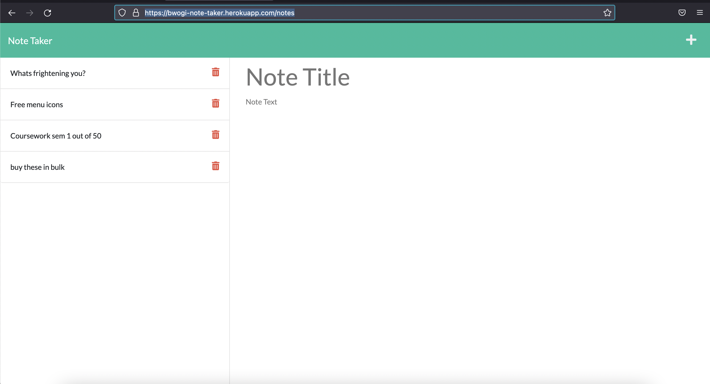

# note-taker   
  

    
    
    
       
  

  ## Description
  This is a fullstack application with a provided front end(starter code) for which i had to create a back end server and middleware for this application to be able to help a user take(create), save, update and delete a note or notes. I used Express.js framework and uniquid library for the unique ids for each note taken. This application helps users take notes whether in a meeting, school or wherever it is deemed necessary effortlessly by take, update read or even delete notes. 
  ##  Usage
  Go to the live site [here](https://bwogi-note-taker.herokuapp.com/) and then click on the 'get started' button. Follow the instructions ion the video [attached](https://youtu.be/6NZCAKLmtKk)

  ## License 
   
  This app is covered under MIT license.
  
  ## Screenshot
   
  ## Demonstration
  [Note taker app demo on youtube](https://youtu.be/6NZCAKLmtKk)
  ## ProjectRepo 
  https://github.com/bwogi/note-taker
  ## Contributors
  Developed by Andrew Bwogi